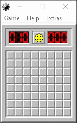
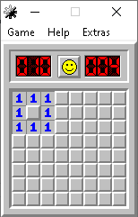
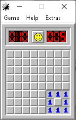
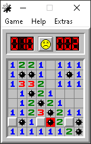
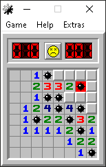
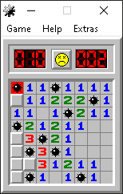
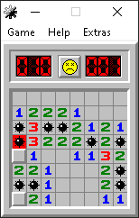
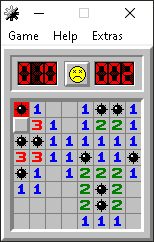

# Minesweeper-Solver-Neural-Network
A solver for the game minesweeper made using convolutional neural networks.

Given a game state, the application tries to pick the cell with the lowest probability of containing a mine. This is achieved using a convolutional neural network.
Let's watch a preview of the application solving an 8x8 game:



# Architecture

The model consists of the input layer, 6 convolutional layers and the output layers. The CNN is a perfect choice for this type of game because it accomplishes location independence. For example, the following two scenarios are technically the same (there is obviously a mine surrounding the ones), but a normal neural network wouldn't recognize it that easily:

 

The input is a matrix of values from the board, having 10 channels (a one-hot encoding of the current game state).
The output is simply a matrix containing the probability of each cell to contain a mine.

# Training

The training is constructed by making use of reinforcement learning.
The idea is simple: the model plays through many games and learns from its mistakes.
On each turn, the model picks the cell with the lowest probability. Based on what that cell contained, the model is trained differently:
- if the cell contained a mine, we tell the network that the probability on that cell should be lower.
- if the cell was safe, we tell the network that the probability on that cell should be higher.

After altering the initial prediction, we train the network.

Many such iterations create a pretty good minesweeper solver.

# Statistics

I decided to test the model in two manners:
- how many games does it win overall
- how many games that went past the first 5 moves does it win

The latter shows how good the model is if we ignore luck as much as possible. On the first testing method, only the very first choice is 100% safe, so the model must guess the next few ones (which results in a little diversification of the win rate). The second testing approach doesn't 100% ignore luck, but it removes the games that are lost prematurely.

After testing each approach on 10000 games, these are the results:
- the first one achieves a ~66% win rate.
- the second one achieves an ~83.21% win rate.

When looking at these results and also at some of the situations the solver loses at, it is quite obvious that we can improve it to reach 80%+ win rate on the overal testing method. This can be done either by finding a better architecture, by coming up with a better training strategy (for example alternating between training early, mid and late game states), by finding the perfect training amount (to not underfit or overfit) etc.

Here are some heartbreaking examples the solver loses in:

    

# Installation:
Note: there are quite a lot of modules that need to be installed, so I recommend creating a virtual environment before installing them.

Clone the repository:
```
git clone https://github.com/neutralove/Minesweeper-Solver-Neural-Network.git
```
Install all the modules:
```
pip install -r requirements.txt
```

# How to Use:

If you want to keep training the module (by default with 1000 batches, 100 game states and 2 epochs), run the "solver.py" file:
```
python solver.py
```
You can also erase all the data in "module.h5" to start the training from scratch (this is also needed if the architecture is modified).

If you want to see the solver in action (by playing a game from the beggining to the end or by solving a game you have already started), run the "main.py" file:
```
python main.py
```
